# شبكة التلازم التعبيري — أن تسأل عن الصُّحبة لا عن العدد

> مقالٌ مفرد في أداةٍ واحدة من أدوات **مرصد اللسانيات القرآنية**، وفي الواجهات
> الثلاث التي تخدم سؤالها.
> الموقع: [quranobservatory.org](https://www.quranobservatory.org/ar)

---

## سؤالٌ بعد سؤال العدد

أكثر ما في المرصد يجيب عن سؤال العدد: كم مرّةً ورد هذا الجذر؟ وفي كم سورة؟ وأين
أوّل موضعٍ له؟ وهو سؤالٌ نافعٌ لا يُستغنى عنه، غير أنّه ليس منتهى ما يعرض
للناظر في ألفاظ التنزيل. فإذا استقرّ العدد بقي سؤالٌ أدقّ منه وأقرب إلى مقصد
الدرس اللغوي:

> **مع مَن يرد هذا اللفظ؟**

وهذا هو **التلازم** (Collocation): أن تُنظر الكلمة لا في نفسها وحدها، بل في
صحبتها؛ فإنّ للألفاظ جيرةً كما للناس، وفي الجيرة دلالة. وقد اشتُهر عند
اللسانيين قول فيرث (J. R. Firth): «إنّك لتعرف الكلمة بصحبتها»، والمرصد يجعل
هذه الصحبة نفسها موضوعاً للعرض والقياس.

والأداة واحدة في جوهرها، وثلاثٌ في واجهاتها، لأنّ السائل ثلاثة أصناف:

| الواجهة | مَن يسأل بها | ما يعرضه |
| --- | --- | --- |
| **شبكة التلازم التعبيري** | مَن يريد جوار الجذر كلَّه دفعةً واحدة | رسمٌ للشبكة |
| **الجوار** (في مساحة البحث) | مَن يريد قائمةً مرتَّبةً بالأدلّة | صفٌّ لكلِّ جار، ومعه الآيات |
| **آيات تجمع كلمتين** (في الصفحة الرئيسة) | مَن في ذهنه زوجٌ بعينه | جوابٌ مباشر عن الزوج |

---

## أولاً: الشبكة

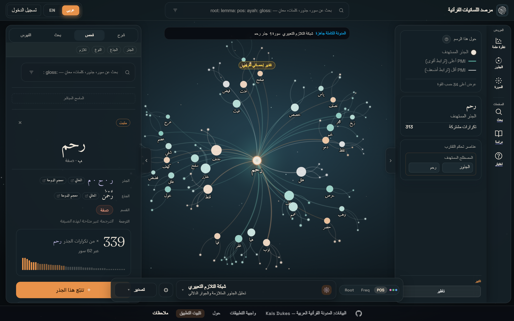

في الوسط **الجذر المستهدف**، وحوله حلقةٌ من الجذور التي تُجاوره في المدونة.
وحجم العقدة ولونها ليسا زينةً: كلاهما محمولٌ على **قوّة التلازم**، لا على
التكرار المجرَّد؛ فالجذر الذي يكثر في المصحف كلِّه ليس بالضرورة جاراً مميِّزاً
لأحد.

وتُصرِّح لوحة «حول هذا الرسم» بما يعرضه وما يحجبه: الشبكة تُظهر **أعلى ٣٤ جاراً
حسب القوّة** لا الجيران كلَّهم — وهو تصريحٌ مقصود، فالحدُّ الذي لا يُذكر يوهم
القارئ أنّه رأى كلَّ شيء.

### بطاقة الجار الواحد


النقر على أيّ جارٍ يفتح بطاقته: كم مرّةً اجتمع بالجذر المستهدف (**التكرارات
المشتركة**)، وما **درجة تلازمه** (PMI)، وبأيّ **جذوعٍ** ورد.

وفي هذا المثال ما يشرح المقياس كلَّه: الجذر (جنف) لم يجتمع بـ(رحم) إلّا
**مرّتين** — وهو عددٌ ضئيل بجانب ٣٣٩ ورودًا للرحمة في ٦٢ سورة — ومع ذلك بلغت
درجة تلازمه **٤٫٣٢**، وهي درجةٌ عالية. وسرُّ ذلك أنّ (جنف) لا يرد في المصحف
كلِّه إلّا **مرّتين اثنتين**، وكلتاهما ختمت بالرحمة:

- ﴿فَمَنْ خَافَ مِن مُّوصٍ **جَنَفًا** أَوْ إِثْمًا … إِنَّ ٱللَّهَ غَفُورٌ **رَّحِيمٌ**﴾ (٢:١٨٢)
- ﴿فَمَنِ ٱضْطُرَّ فِى مَخْمَصَةٍ غَيْرَ **مُتَجَانِفٍ** لِّإِثْمٍ فَإِنَّ ٱللَّهَ غَفُورٌ **رَّحِيمٌ**﴾ (٥:٣)

فاجتماعٌ مرّتين من مرّتين أدلُّ من اجتماع لفظٍ شائعٍ عشرين مرّة. وهذا وحده ما
يفصل بين «الأكثر ورودًا» و«الأخصّ اقترانًا» — وعليه بُني المقياس.

ولاحظ أنّ الجذعين المعروضين في البطاقة — **جَنَف** و**مُتَجَانِف** — هما بعينهما
لفظا الموضعين.

### الطبقة الثالثة: الجذوع

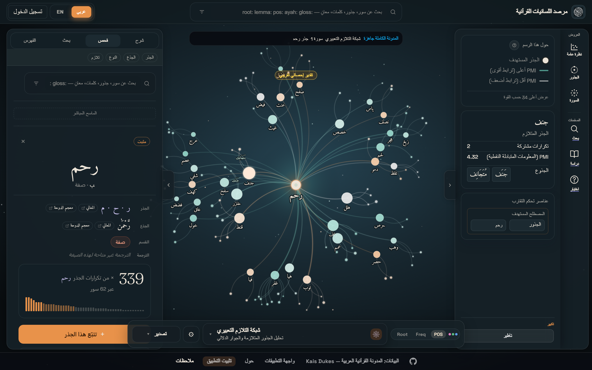

من كلّ عقدةٍ متلازمة تتفرّع خيوطٌ أدقّ: هي **الجذوع** — صيغ الكلمة كما وردت في
المتن. وفائدتها أنّها تقول لك بأيّ صورةٍ جاء الجار: أباسمٍ أم بفعلٍ أم بصفة؛
فليس اجتماع (رحم) بمصدرٍ كاجتماعه بفعلٍ ماضٍ، والرسم يفرّق بينهما بدل أن يطويهما
في عقدةٍ واحدة.

---

## ثانياً: ما الذي يقيسه؟ ولماذا لا يكفي التكرار؟

لو رُتِّب الجيران بالتكرار المجرَّد لخرجت القائمة واحدةً تقريباً لكلّ جذور
القرآن: (الله)، و(قال)، و(الذين)، و(من)… وهي جيرانٌ للجميع، فلا تدلُّ على أحد.

فالمعتمَد إذاً **المعلومات المتبادلة النقطية** (PMI)، وحاصلُها نسبةُ ما وقع
فعلاً من اجتماع اللفظين إلى ما كان يُتوقَّع وقوعه لو كان الاجتماع محضَ مصادفة:

```text
درجة التلازم = log₂ ( (عدد الاجتماعات × مجموع النوافذ) ÷ (تكرار الأوّل × تكرار الثاني) )
```

فإن كانت النتيجة صفراً فالاجتماع بقدر ما تقتضيه المصادفة لا زيادة، وكلّما ارتفعت
كان الاقتران أندر وأخصَّ وأجدر بأن يُنظر فيه. وبهذا يعلو (كَفُور) و(يَئُوس)
على (مِن) و(إنّ) في جوار (إنسان)، وهو الجواب الذي يطلبه الباحث.

وقد وُسِم الرسم بوسمٍ ظاهرٍ لا يُخفى: **«تقدير إحصائي تقريبي»**، تنبيهاً على أنّ
هذه الدرجة استنباطٌ حسابيٌّ من مواضع الألفاظ، وليست وسماً منصوصاً عليه في
المدونة، ولا حكماً بلاغياً، ولا قولاً في التفسير. وهي **دالّةٌ على موضع النظر،
لا قائمةٌ مقام النظر**.

على أنّ الدرجة وحدها لا تكفي حارساً، فاللفظ النادر جدًّا قد ترتفع درجته من
اجتماعٍ واحدٍ عارض. ولذلك قُرن بها **حدٌّ أدنى للتكرار المشترك** في الرسم، يأتي
بيانه في عناصر التحكُّم.

---

## ثالثاً: النافذة هي السؤال

أخطر ما في هذا الباب أن يُظنّ أنّ للتلازم جواباً واحداً. وليس كذلك: الجواب تابعٌ
**لنطاق السياق** الذي تُقاس فيه المجاورة، ومن ثَمّ جُعل النطاق عنصر تحكُّمٍ
ظاهراً لا افتراضاً مستوراً.

- **سياق الآية كاملة** — فتعكس التلازمات موضوعاتٍ أوسع.
- **نافذة الكلمات القريبة** (± ن كلمة) — فتعكس صياغةً محلّيةً وتركيباً مجاوراً.
- **سياق السورة** — فيبرز الترابط الموضوعي على مستوى السورة.

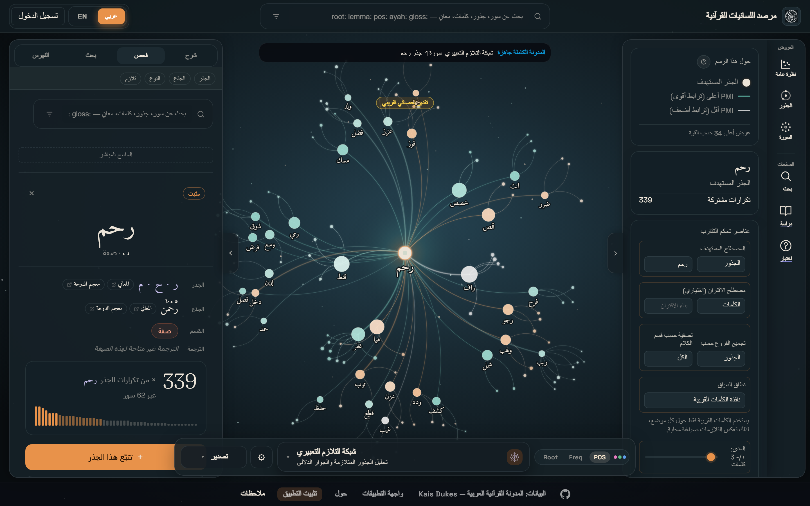

وقارِن بين الصورتين: هما لجذرٍ واحد (رحم)، ولم يتغيّر بينهما إلّا النطاق.

- تحت **سياق الآية**: (جنف)، و(قنط)، و(غيث)، و(هلل)، و(لحم)… وهي جيرةُ
  **موضوعٍ**؛ ألفاظٌ تقع معها في الآية الواحدة لأنّ المقام جمعها.
- تحت **نافذة الكلمات القريبة** (± ٣ كلمات): (رأف)، و(توب)، و(ودد)، و(غفر)…
  وهي جيرةُ **سبك**؛ إذ الفواصل التي تلي الرحمة في القرآن معروفة:
  ﴿غَفُورٌ رَّحِيمٌ﴾، و﴿تَوَّابٌ رَّحِيمٌ﴾، و﴿رَءُوفٌ رَّحِيمٌ﴾، و﴿وَدُودٌ﴾.

فالجذر الواحد يعطي جوارين مختلفين، **وليس أحدهما خطأً**: الأوّل يجيب «ما
موضوعات الآيات التي يرد فيها؟»، والثاني يجيب «ما الألفاظ التي تلتصق به في
السبك؟». وسؤالان مختلفان لا يُنتظر لهما جوابٌ واحد.

### عناصر التحكُّم

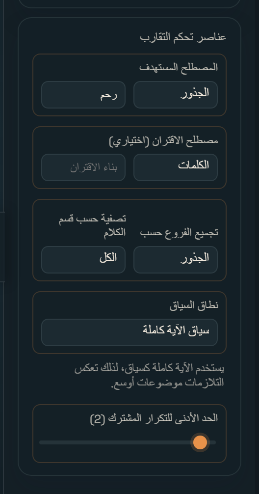

- **المصطلح المستهدف** — جذراً أو بناءً.
- **مصطلح الاقتران** — فيقصر الشبكة على ما يجتمع بالاثنين معاً.
- **تجميع الفروع** — بالجذور أو بالكلمات.
- **التصفية بقسم الكلام** — لقصر الجيران على الأسماء أو الأفعال أو الصفات.
- **نطاق السياق** — ومعه مدى نافذة الكلمات إن اختيرت.
- **الحدّ الأدنى للتكرار المشترك** — وهو اثنان بالمبدأ، فلا يُبنى تلازمٌ على
  اجتماعٍ واحدٍ عارض.

> **تنبيه:** الزائر أوّل عهده لا يرى من هذه اللوحة إلّا **المصطلح المستهدف**
> وحده، تخفيفاً للحمولة المعرفية. وسائرُها يظهر إذا رُفع **«مستوى التعقيد»** إلى
> **«متقدّم»** من إعدادات العرض.

---

## رابعاً: الجوار — التلازم جواباً لا رسماً

الرسم يصلح للنظر الشامل، ولا يصلح للاستشهاد. فأُخرج السؤال نفسه في **مساحة
البحث** قائمةً مرتَّبة، تحت عنوان **الجوار**: «مَن يُذكر قرب …».

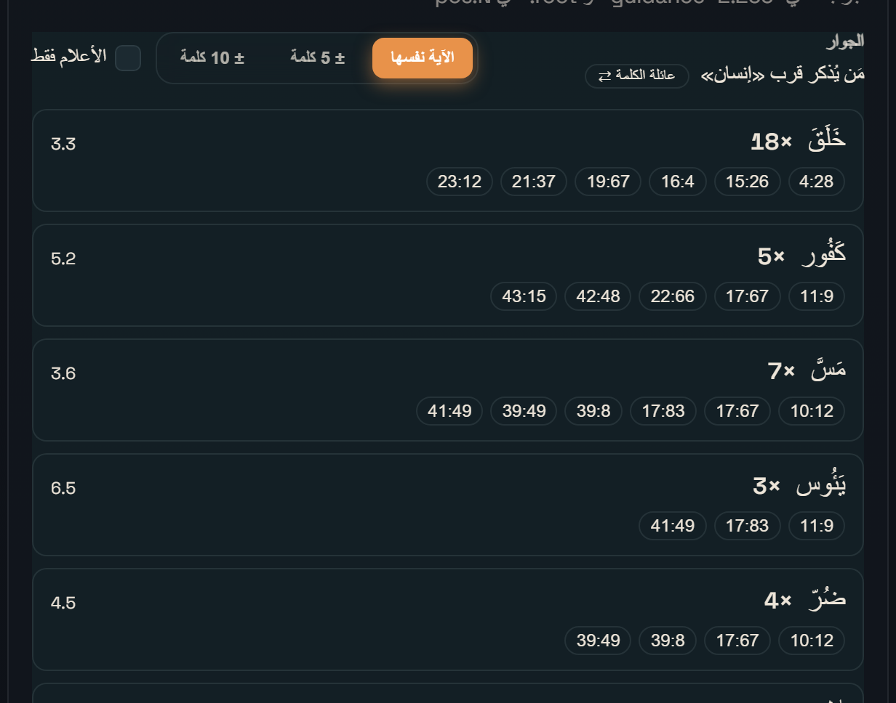

فيخرج للباحث عن (إنسان) جوارٌ لم يكتبه هو، ومع كلّ صفٍّ درجتُه ومواضعُه:

| الجار | الاجتماعات | الدرجة |
| --- | --- | --- |
| خَلَقَ | ×١٨ | ٣٫٣ |
| كَفُور | ×٥ | ٥٫٢ |
| مَسَّ | ×٧ | ٣٫٦ |
| يَئُوس | ×٣ | ٦٫٥ |
| ضُرّ | ×٤ | ٤٫٥ |

وفي هذا الجدول بيان الترتيب: فـ(يَئُوس) أعلى درجةً من (خَلَقَ) — ٦٫٥ في مقابل
٣٫٣ — ومع ذلك تأخّر عنه في القائمة. وذلك أنّ الترتيب ليس بالتكرار وحده ولا
بالدرجة وحدها، بل **بحاصل ضربهما**؛ إذ لو رُتِّبت القائمة بالتكرار وحده
لتصدّرتها حروف المعاني، ولو رُتِّبت بالدرجة وحدها لتصدّرها كلُّ لفظٍ نادرٍ
اتّفق له اجتماعٌ واحد. وتُقصر القائمة على الأسماء والأفعال والصفات، فالحروف
والضمائر بناءٌ لا جواب.

### الدليل هو الآية

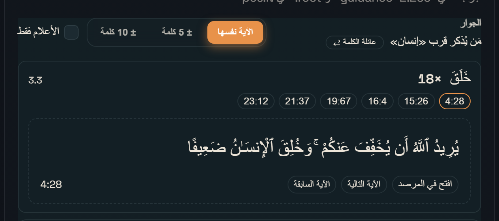

كلُّ صفٍّ دعوى في اجتماع لفظين، ودليلها الآية. فمواضع الصفّ ليست أرقاماً
جامدة: النقر على الموضع يفتح الآية في مكانها، ومعها **السابقة واللاحقة** على
مسافة نقرة — وذلك بعينه سبب وجود النوافذ، كما يتبيّن في الفصل التالي.

### الأعلام فقط، وحكاية «لأبيه»

هنا تظهر ثمرة الباب كلِّه. الصيغة **﴿لِأَبِيهِ﴾** ترد **تسع مرّات**، والسؤال
الذي يعرض لقارئها بديهيّ: **مَن القائل؟**

نُقصر الجوار على الأعلام، وننظر تحت النافذتين:

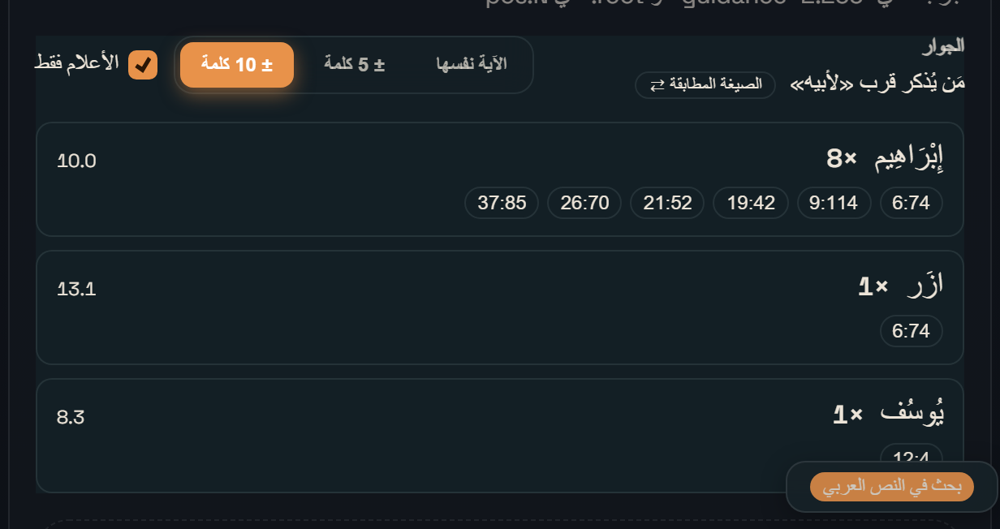

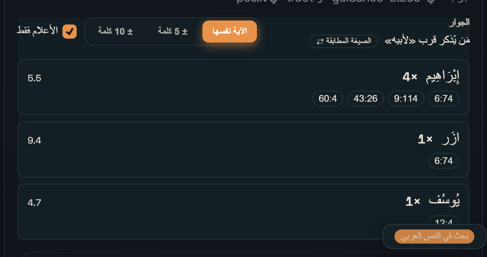

| النافذة | إِبْرَاهِيم | آزَر | يُوسُف |
| --- | --- | --- | --- |
| **الآية نفسها** | ×٤ | ×١ | ×١ |
| **± ١٠ كلمات** | ×٨ | ×١ | ×١ |

والفرق ليس خللاً في العدّ، بل هو **الجواب نفسه**: إبراهيم مسمّىً في الآية ذاتها
أربع مرّات — ٦:٧٤ و٩:١١٤ و٤٣:٢٦ و٦٠:٤ — أمّا في المواضع الأربعة الأخرى فالاسم
في **الآية السابقة** والضمير في اللاحقة:

- ﴿وَٱذْكُرْ فِى ٱلْكِتَٰبِ إِبْرَٰهِيمَ﴾ (١٩:٤١) ← ﴿إِذْ قَالَ لِأَبِيهِ﴾ (١٩:٤٢)
- ﴿وَلَقَدْ ءَاتَيْنَآ إِبْرَٰهِيمَ رُشْدَهُۥ﴾ (٢١:٥١) ← (٢١:٥٢)
- ﴿وَٱتْلُ عَلَيْهِمْ نَبَأَ إِبْرَٰهِيمَ﴾ (٢٦:٦٩) ← (٢٦:٧٠)
- ﴿وَإِنَّ مِن شِيعَتِهِۦ لَإِبْرَٰهِيمَ﴾ (٣٧:٨٣) ← (٣٧:٨٥)

فالنافذة الضيّقة تقول: «إبراهيم مذكورٌ معه أربعاً»، والواسعة تقول: «القائل
إبراهيم في ثمانيةٍ من تسعة». وكلاهما صادق، والفرق بينهما **فرق سؤال لا فرق
صواب**؛ ولذلك جُعل اختيار النافذة بيد الباحث ظاهراً على الشاشة، لا مطويّاً في
إعدادٍ لا يراه.

وأمّا الموضع التاسع فقائله غير إبراهيم: ﴿إِذْ قَالَ يُوسُفُ لِأَبِيهِ﴾ (١٢:٤).

### المرساة: الصيغة المطابقة أم عائلة الكلمة؟

في رأس اللوحة وسمٌ يقلب المرساة: **«الصيغة المطابقة ⇄ عائلة الكلمة»**.

والفرق جوهريّ: ﴿لِأَبِيهِ﴾ تسعة مواضع بعينها، وسؤال «مَن القائل» صفةٌ لهذه
التسعة لا لعائلة (أب) كلِّها. فلو أُرسي السؤال على العائلة لأُدخلت معها (لأبي)
و(لأب) وسائر الصيغ، ولانقلب سؤالٌ عن تسعة مواضع سؤالاً آخر. ولذلك تُرسى الصيغة
على مواضعها المحصورة متى كانت مواضعها معلومةً كاملةً — وهو حال أكثر من تسعة
أعشار الصيغ — وإلّا رُجع إلى العائلة، **والوسم يقول أيُّهما الجاري**، فلا
يلتبس الجوابان.

---

## خامساً: `قرب:` — التلازم في لغة الاستعلام

ثمّ نُقل التلازم خطوةً أخرى: صار **عاملاً في لغة الاستعلام** نفسها، يُكتب في
حقل البحث:

```text
لأبيه قرب:يوسف
```

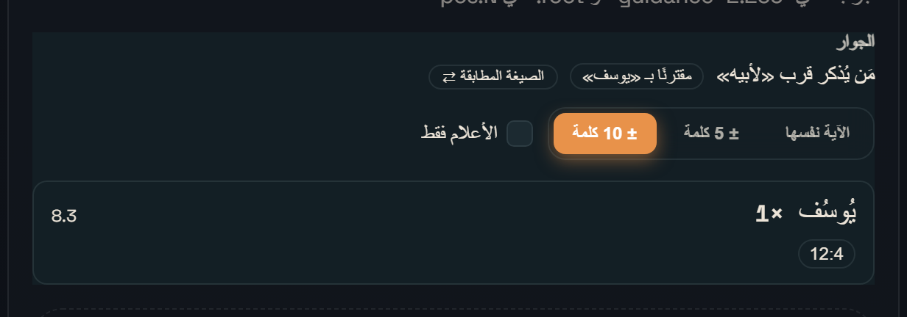

فيُقصر الجوار على مصاحبٍ واحد، ويُعرض ما بينهما من مواضع. و`قرب:` هو **أوّل
عاملٍ عربيٍّ في لغة الاستعلام** في المرصد، إلى جانب `near:` الإنجليزي، وسائر
العوامل: `root:` و`lemma:` و`pos:` و`ayah:` و`gloss:`.

---

## سادساً: آيات تجمع كلمتين — في الصفحة الرئيسة

يبقى صنفٌ ثالث من السائلين: مَن لا يريد جواراً ولا شبكة، بل في ذهنه **زوجٌ
بعينه**: «أين اجتمع هذان اللفظان؟». وهذا سؤالٌ مباشر، فجوابه في الصفحة الرئيسة
لا في المرصد.

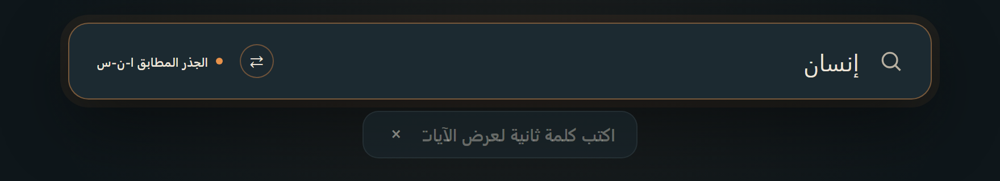

إلى جانب نتيجة البحث زرُّ **⇄**، يفتح شريطاً ثانياً أصغر: «اكتب كلمة ثانية لعرض
الآيات التي تجمعهما».

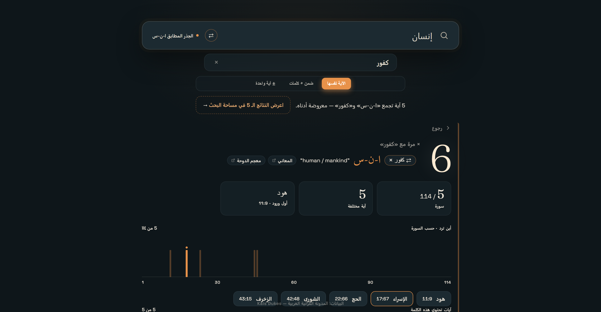

فإذا كُتبت الكلمة الثانية لم تُفتح شاشةٌ جديدة، بل **أُعيد بناء البطاقة نفسها
مقصورةً على ما يجمع اللفظين**: العدد الكبير، والبطاقات الثلاث، وشريط السور
الأربع عشرة بعد المئة، وقائمة الآيات — كلُّها للزوج لا للفظ وحده.

فـ(ا-ن-س) مع (كفور): **٥ آيات** في **٥ سور**، أوّلها ﴿هود ١١:٩﴾. والعدد الكبير
في صدر البطاقة **٦** لا ٥، لأنّه يعدّ **المواضع** لا الآيات: ففي ﴿الشورى
٤٢:٤٨﴾ ورد اللفظ مرّتين في آيةٍ واحدة ﴿… أَذَقْنَا ٱلْإِنسَٰنَ مِنَّا رَحْمَةً
… فَإِنَّ ٱلْإِنسَٰنَ كَفُورٌ﴾. وهو المعنى نفسه الذي يحمله ذلك العدد قبل
الاقتران وبعده، فلا ينقلب معناه على القارئ في منتصف الطريق.

وهذه المواضع الخمسة (١١:٩ و١٧:٦٧ و٢٢:٦٦ و٤٢:٤٨ و٤٣:١٥) هي بعينها التي عرضها
صفُّ (كَفُور) في لوحة الجوار قبل قليل — والواجهتان تعملان على طريقين مختلفين
تماماً ثمّ تلتقيان على جوابٍ واحد.

### والنوافذ ههنا ثلاث أيضاً

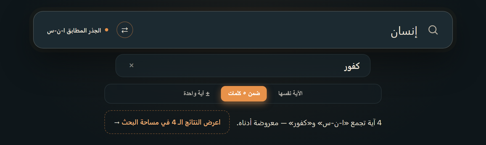

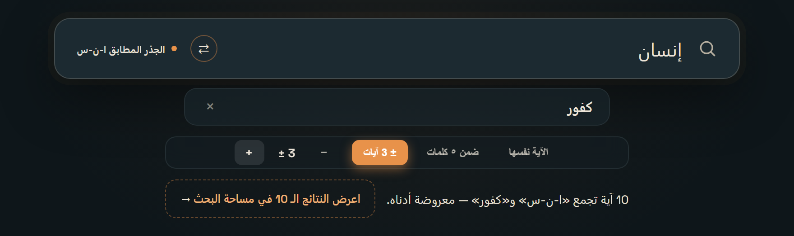

| النطاق | (ا-ن-س) مع (كفور) |
| --- | --- |
| ضمن ٥ كلمات | ٤ آيات |
| الآية نفسها | ٥ آيات |
| ± آية واحدة | ٩ آيات |
| ± ٣ آيات | ١٠ آيات |

والمدى في النطاق الأخير **قابلٌ للتوسيع والتضييق** من آيةٍ واحدة إلى عشر. وقد
جُعل له حدٌّ ينتهي إليه، لا لعجزٍ في الحساب، بل لأنّ التوسّع بعد ذلك يُنفخ
الأعداد ويُذهب معنى «المجاورة» أصلاً.

وأخيراً، البطاقة تعرض عشر آياتٍ لا أكثر، وتحت العدد رابطٌ: **«اعرض النتائج الـ
ن في مساحة البحث»** — ينقل السؤال نفسه إلى مساحة البحث عبر العامل `قرب:`، حيث
لا حدَّ للعرض.

---

## سابعاً: ما لا تقوله الأداة

وحقُّ الأداة أن يُذكر ما لا تُحسنه كما ذُكر ما تُحسنه:

1. **الدرجة تقديرٌ إحصائيّ**، مبنيّةٌ على مواضع الألفاظ، لا وسمٌ في المدونة ولا
   حكمٌ بلاغيّ. وهي تدلُّك على الموضع، والنظرُ بعدُ نظرُك.
2. **التلازم ليس دلالة.** اجتماع لفظين كثيراً لا يلزم منه اقترانٌ في المعنى؛ قد
   يكون سبكاً، وقد يكون سياق قصّةٍ واحدة تكرّرت.
3. **الشبكة تحجب ما بعد الأربعة والثلاثين**، وتُسقط ما دون الحدّ الأدنى من
   الاجتماع. وهو مصرَّحٌ به في اللوحة.
4. **أرقام الكلمات فيها انزياحٌ يسير**: ترقيم المدونة يخالف ترقيم quran.com في
   نحو ٤٣٥ آيةً تعدّ فيها الكلمة المركّبة كلمتين. ولذلك تُحتَسب النوافذ الضيّقة
   بهامشٍ يستوعب الانزياح، أمّا نطاق **الآيات المجاورة** فلا يُحسب بالكلمات
   أصلاً، فهو في مأمنٍ منه.
5. **الاختلاف بين النوافذ ليس خطأً**، وقد تقدّم بيانه في حكاية ﴿لِأَبِيهِ﴾.

---

## البيانات والنسبة

البيانات من **المدونة القرآنية العربية — Kais Dukes**
([corpus.quran.com](https://corpus.quran.com))، وواجهة
[quran.com](https://api-docs.quran.com/). والمشروع مفتوح المصدر على
[GitHub: Quranic-Linguistics-Observatory](https://github.com/lAvArt/Quranic-Linguistics-Observatory).

وهي دعوةٌ لكلّ من يسعى في خدمة هذا الكتاب أن يُسهم بالتصويب والنصح فيما لا يسعنا
الخطأ فيه، سائلين الله التوفيق والسداد والنفع.
