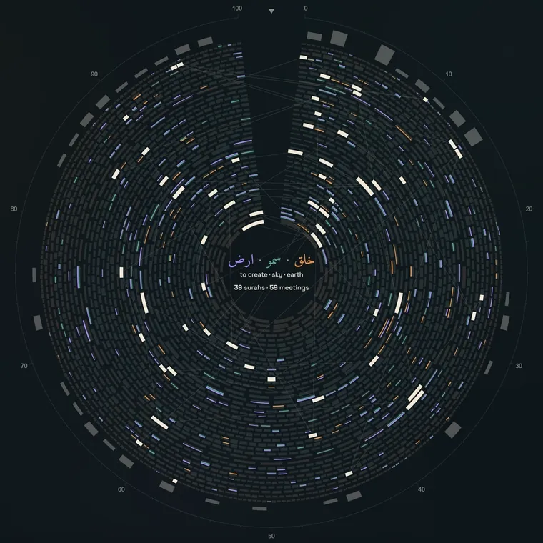
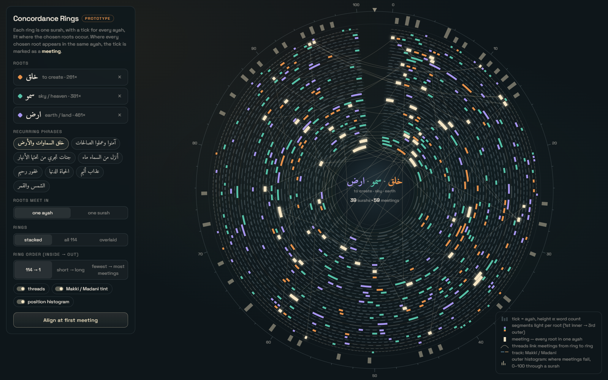
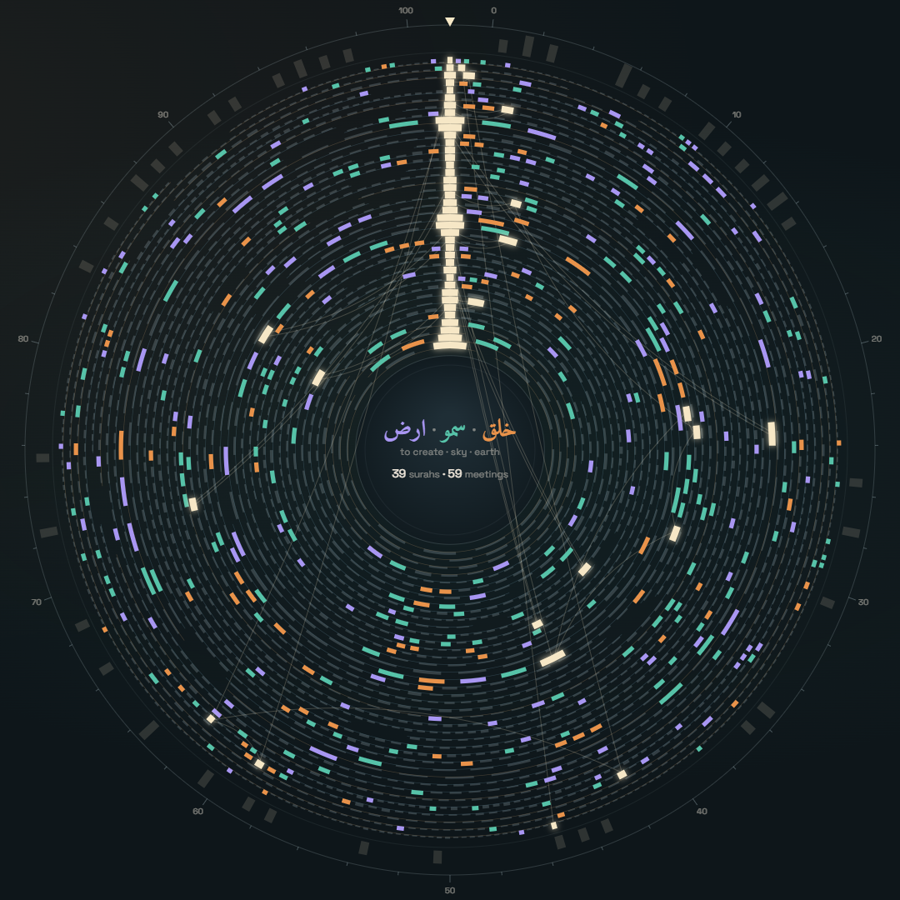
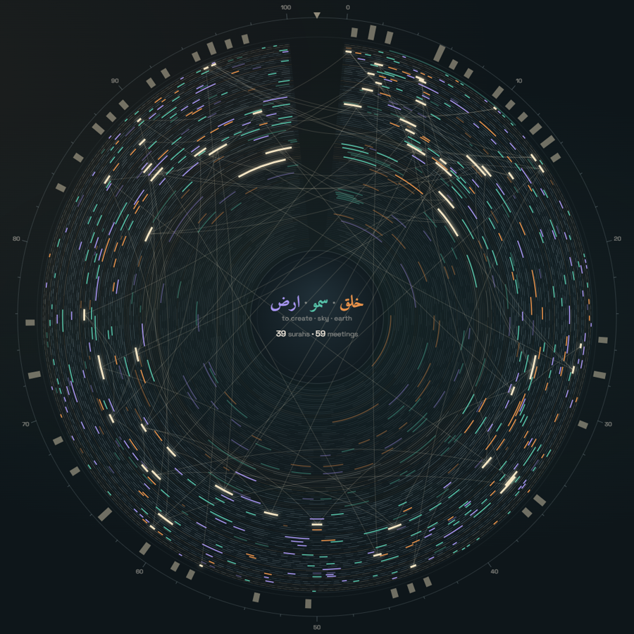
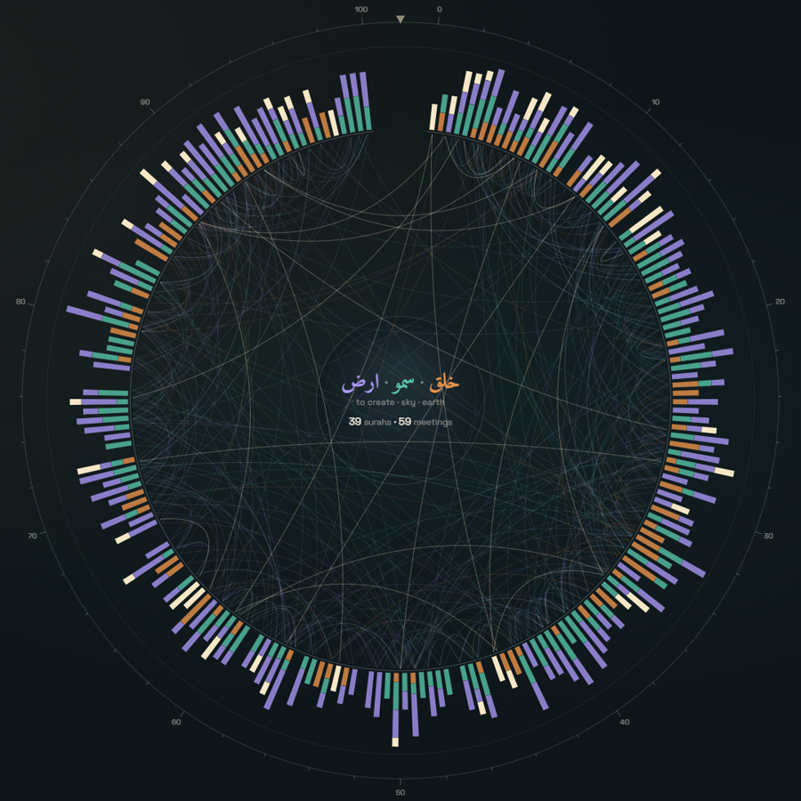
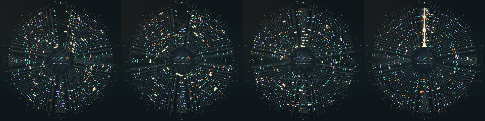
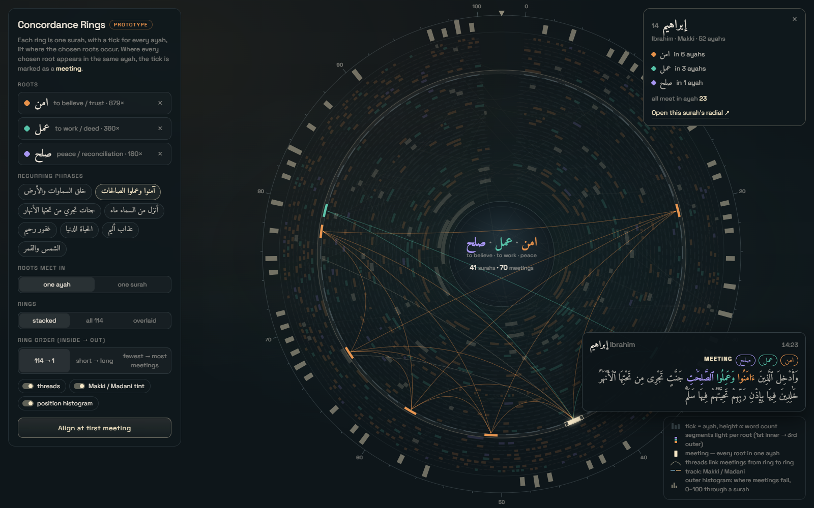

# Concordance Rings

A visualisation for the observatory: where two or three roots occur across the whole Quran, and where they occur together. It extends the ring language of `radial-sura` from one surah to many. Every surah becomes a ring, every ayah a tick on it, and the ticks light up where the chosen roots appear.

  

_The app, recorded frame by frame: rest → sort by first meeting (travel) → align at first meeting (turn) → hover. `npm run docs:record-rings` re-records it against a running dev server; see [Implementation notes](#implementation-notes)._

_Status: built as viz mode `concordance-rings`. Written 2026-09-28._

**What is built.** All four views, both motions (turning and travelling, with the expressive and calm turn styles), threads, the outer scale and histogram, hover with the full ayah text, ring selection with inner wiring and the surah card, the ring order by first meeting, deep links, keyboard stepping, reduced motion, and the narrow-screen default to the overlaid view. Ticks are drawn in WebGL2 with the `Path2D` fallback.

**Not built yet.** The alternative anchors under _Turning_ (last meeting, first occurrence of one root, median meeting).

**Data.** `scripts/build-concordance.ts` (`npm run data:concordance`) writes two files. `public/data/concordance.json` is the per-ayah root map, 337 KB raw and 91 KB gzipped, fetched when the mode opens. `public/data/concordance-text.json` is the words of every ayah, 1.4 MB raw and 258 KB gzipped, fetched on the first hover. `lib/corpus/concordanceClient.ts` turns a root selection into rings, ticks and meetings; its tests reproduce every preset count in the table below from the corpus.

## Reading the rings

| Element | What it shows |
| --- | --- |
| Ring | One surah. Inside to outside follows the chosen order: mushaf order (114 → 1), length (short → long) or number of meetings. The ring's track is tinted by revelation place, cool for Makki and warm for Madani. |
| Tick | One ayah. Its angle is the ayah's position in the surah, normalised from 0 to 100 around the ring; a small gap at 12 o'clock holds the surah number. Its height follows the ayah's word count. |
| Coloured segment | Where a chosen root occurs in that ayah. Each root has its own colour and its own radial slot, the first innermost. On thin rings the tick takes the first root's colour. |
| Meeting | A cream tick where every chosen root occurs in the same ayah. |
| Thread | A faint line from each meeting to the nearest meeting on the next ring out, so drift in position between surahs is visible. |
| Outer scale and histogram | 0 to 100 through the surah, with a histogram of where meetings fall. |
| Centre | The chosen roots with their glosses, and the number of surahs and meetings. |

The **Roots meet in** switch sets which surahs qualify. With **one ayah**, a surah needs at least one meeting. With **one surah**, it only needs every root somewhere in it.

## Views

- **Stacked**, the default: only the surahs that qualify, one ring each (image above).
- **All 114**: the whole Quran, with the rings that don't qualify dimmed.
- **Overlaid**: every qualifying surah stretched onto one ring at normalised positions. Stacked bars count each root's occurrences by position, with meetings on top. Inside the ring, each surah's consecutive occurrences of a root are joined by chords, all surahs superimposed.
- **Align at first meeting**: every ring rotates, animated, until its first meeting sits under the marker at 12 o'clock. The meetings stack into one column, and later meetings can be compared as distances from the first. See [Motion](#motion-sorting-and-aligning) for how the rings move.

| Aligned at first meeting | All 114 | Overlaid |
| --- | --- | --- |
|  |  |  |

## Motion: sorting and aligning

The rings move in two ways. They **turn**, which is aligning: a ring's angle changes. They **travel**, which is sorting: a ring's radius changes. Both animate between two states the reader could also jump between, so the motion shows _what changed_ rather than decorating it. Both are built as described below.

### Turning (align)

- **Target.** Each ring turns until its anchor ayah is centred under the marker at 12 o'clock. The prototype anchors on the first meeting. Rings without an anchor end at their starting angle.
- **Other anchors worth offering.** The last meeting, the first occurrence of one chosen root, or the median meeting. Each answers a different question, such as "where does the phrase end up?" versus "where does it start?".
- **Prototype choreography.** Each ring's motion is set by its index _k_, counted from the innermost ring:
  - Rings alternate direction: the innermost turns anticlockwise, the next clockwise, and so on.
  - Each ring makes 1 to 3 extra full turns, cycling with _k_, before settling.
  - Starts are staggered by 22 ms per ring, innermost first.
  - Each ring's motion lasts 1,100 ms plus 380 ms per extra turn, eased in and out (cubic).
  - In total, 39 rings settle in about 3.1 s and all 114 in about 4.7 s.
- **Reset** runs the same choreography back to angle 0.
- **Once aligned,** the marker lights and the position histogram dims to about a third. Its positions describe the unrotated rings, so they stop being meaningful while the rings are turned.
- **A calmer variant for the app.** Each ring takes the shortest turn to its target, with no extra turns, in about 600 ms, with 8 ms stagger: about 1.5 s for all 114 rings. The expressive version suits a first-time demonstration; the direct one suits repeated use.

### Travelling (sort)

- **When it happens.**
  - The ring order changes: mushaf, length, number of meetings, or position of first meeting (below).
  - The view switches between stacked and all 114.
  - The chosen roots change.
- **Motion.** Each ring moves from its old radius to its new one in about 700 ms, eased in and out, with starts staggered by how far it travels. Ring thickness stays constant, and surah numbers travel with their rings. If the ring count changes, the thickness eases to its new value at the same time.
- **Crossings.** Rings pass through each other on the way. To keep that legible, a moving ring draws at about 60% opacity, and threads and the histogram fade out while anything travels, returning once everything is at rest. Both depend on which rings are neighbours.
- **Entering and leaving.** A ring that leaves collapses to zero thickness where it stands. A ring that arrives grows from zero at its new radius. The rest re-space around them.
- **A new order: by position of first meeting.** Rings are sorted by where their first meeting falls in the surah. At rest, the first meetings then trace a spiral from the centre outward. Aligning afterwards turns the spiral into the column, a two-step sequence that shows both where meetings sit and how they compare.

### Choreography rules

- Travelling changes radius and turning changes angle, so they can run at once. Played in sequence, sort first and then align, they read better.
- A new request in mid-motion restarts from where each ring currently is. Nothing snaps.
- Hover, tooltips and ring selection stay live during motion.
- With `prefers-reduced-motion`, both motions jump straight to their end state.

### Implementation notes

- **Turning is cheap.** Each ring's rotation is one number per frame, written into the same buffer as its opacity, and the tick geometry is never rebuilt. The prototype turns all 114 rings at 60 fps at 2× density (see the table under Rendering).
- **Travelling is just as cheap.** The prototype baked each tick's radii into its geometry; the app instead keeps each ring's radius and thickness in the same per-ring texture as its rotation and opacity (2 × 128 texels), and each tick stores only its radial slot as a fraction of the ring. A sort updates four numbers per ring per frame and never rebuilds a tick.
- **Time comes only from the animation clock** (`requestAnimationFrame` timestamps and `performance.now`). A virtual clock can therefore step the motion frame by frame for tests and recordings. That is how the filmstrip above was made, and the recording at the top: `scripts/record-concordance.ts` installs Playwright's clock, advances it exactly 1/25 s before each screenshot, and joins the frames into an animated WebP, so the result is smooth however slowly the machine renders. It launches Chromium with `--use-angle=d3d11` (see [Measure on the GPU](#rendering-and-performance)).

## Interactions

- **Choosing roots.** Up to three roots, typed in Arabic (insensitive to hamza and alif forms), in Buckwalter, or as an English gloss. Suggestions are ranked by frequency.
- **Recurring phrases** as one-click presets. Counts are surahs where the roots meet in at least one ayah:

  | Phrase | Roots | Surahs |
  | --- | --- | --- |
  | آمنوا وعملوا الصالحات | امن · عمل · صلح | 41 |
  | عذاب أليم | عذب · الم | 41 |
  | خلق السماوات والأرض | خلق · سمو · ارض | 39 |
  | غفور رحيم | غفر · رحم | 37 |
  | الحياة الدنيا | حيي · دنو | 34 |
  | جنات تجري من تحتها الأنهار | جنن · جري · نهر | 25 |
  | أنزل من السماء ماء | نزل · سمو · موه | 21 |
  | الشمس والقمر | شمس · قمر | 18 |

- **Hovering a tick** shows the surah, the ayah reference and the full ayah text, with the words carrying the chosen roots coloured. In the overlaid view, hovering a position lists the ayahs that fall there.
- **Clicking a ring** dims the others and draws that surah's own root wiring inside it, as `radial-sura` does for one surah. A card lists how many ayahs hold each root and where they meet, and links to the surah's radial view.

## Data and method

- **Source.** The Quranic Arabic Corpus morphology file (v0.4, Kais Dukes), read offline, as `scripts/build-root-stats.ts` does. The `corpus_tokens` database table is not used, which avoids its known word-alignment issue.
- **Counting.** Each word counts once, with its stem's root: 77,429 words, of which 49,967 carry one of 1,642 roots. For matching, hamza and alif forms inside a root are folded together.
- **Normalised position.** Ayah _i_ of a surah with _N_ ayahs sits at (_i_ − ½) / _N_.
- **Meeting.** An ayah containing every chosen root.
- **Tick height.** The ayah's word count, relative to the longest ayah in the same surah.
- **Payload.** Two files. The root map holds each word's root index: 337 KB raw, 91 KB gzipped. The text holds each word as the corpus writes it: 1.4 MB raw, 258 KB gzipped, fetched only on hover.

## Rendering and performance

The prototype runs at 60 fps for hovering and for the rotation, at 2× pixel density. What got it there applies to any ring view in the app:

- **Layered canvases.** Scale, histogram and centre are drawn once; tracks and threads sit under the ticks; meetings, selection and labels sit above them; hover gets a layer of its own. Hovering never repaints the rings.
- **Ticks in WebGL.** Chrome's GPU-backed 2D canvas slows to 4–12 fps when it redraws thousands of tiny anti-aliased shapes every frame. Drawing the ticks as one instanced WebGL2 call, with the ring sector cut exactly in the fragment shader, restores 60 fps with no visible change: pixel diffs against the 2D rendering average 0.1/255.
- **Fallback.** Where WebGL2 is missing or software-emulated (`failIfMajorPerformanceCaveat`), the ticks fall back to one small `Path2D` per tick on the 2D canvas.

Measured with Playwright under GPU rasterisation at 2× density:

| | Before | After |
| --- | --- | --- |
| Hover, stacked / all 114 / overlaid | 11 / 4 / 36 fps | 60 / 60 / 60 fps |
| Rotation, stacked / all 114 | 12 / 5 fps | 60 / 60 fps |

`radial-sura` redraws a similar number of small shapes; if it ever animates, the same approach applies.

**In the app.** Measured the same way, on an NVIDIA RTX 5080 through ANGLE and Direct3D 11 at 2× density, with the app shell around it: hover and turning run at 60 fps in the stacked and all-114 views, and hover at 60 fps in the overlaid view, with a 95th-percentile frame of 16.7 ms. Each frame costs about 0.4 ms of JavaScript. Only a 2×128 texture of ring positions changes per frame.

**Measure on the GPU.** Headless Chromium on Windows renders WebGL through SwiftShader, a software GPU, unless it is launched with `--use-angle=d3d11`. Under SwiftShader a full-screen clear alone manages 35 fps, and this mode turns at about 15 fps. Those numbers describe the emulator, not the code. Also, `failIfMajorPerformanceCaveat` did not reject SwiftShader through ANGLE's Vulkan backend, so the fallback rule above does not fire on such machines: they get software WebGL, not the 2D path.

## Integration

- **Mode.** A tenth viz mode, `concordance-rings`. It is listed with the root views (root network, root flow, collocation) rather than with `radial-sura`, because it follows roots across the corpus rather than studying one surah. Deep link: `/{locale}?viz=concordance-rings&roots=خلق,سمو,ارض&view=stacked`, where root params are plain-alif corpus keys, as elsewhere. The link also carries `meet` and `order` when they differ from the defaults.
- **Data.** `scripts/build-concordance.ts` emits the per-ayah root indices to `public/data/`, loaded lazily when the mode opens. Ayah text is built by the same script, not taken from the app's text source (see _Ayah text_ under Open questions).
- **Embeds and the graph gallery.** `/embed/concordance-rings` renders the mode on its own, with the same `roots` and `view` parameters, and the mode has an entry in the indexable graph gallery (`lib/seo/vizGallery.ts`), whose still is built by `npm run graphs:build`. The mode loads its own data, so neither waits for the corpus tokens.
- **Shell.** Controls render into the sidebar portal. The selected-ring card, and the list of meetings when no ring is selected, render into the details panel through `#viz-context-portal`, a slot added to the context drawer for this. Root colours are the theme-stable `--viz-root-1..3` and `--viz-meeting` tokens: three roots need three categorical colours, and `--viz-cat-*` has two. The rings fit the part of the stage the shell's chrome leaves visible (`getVisibleArea` in `lib/viz/fitToView.ts`). Toggles are custom switches, not native checkboxes.
- **Accessibility.** Keyboard steps between rings and ticks. A text alternative lists the meeting ayahs as a table. With `prefers-reduced-motion`, the rings align without animating.
- **Mobile.** Below about 700 px rings get too thin to read, so open in the overlaid view or cap the ring count.
- **Credit.** The footer credits Kais Dukes and the Quranic Arabic Corpus, as on every page.

## Open questions

- **Name.** "Concordance Rings" is a working title, after the classical concordance. The Arabic label in the app, حلقات المعجم المفهرس, is a placeholder after _al-Muʿjam al-Mufahras_. It still needs a decision.
- **Threads.** The nearest-meeting rule is a display choice; linking by surah order, or not linking at all, are alternatives worth trying.
- ~~**Ayah text.** Bundle it with the payload, or fetch per hover?~~ Settled, though not as first proposed. It stays out of the root map and loads on the first hover, but it cannot come from the app's existing text source. Hover colours root words by word index, and that source (Supabase and Quran.com) numbers words differently wherever the corpus splits or merges a written word, the same drift that affects `corpus_tokens`. So the text is built from the morphology file alongside the root map and lines up with it index for index: 0 of 6,236 ayahs differ in word count.
- **Scope.** Should the mode accept one or two roots only, or allow more than three with a different colour scheme?
