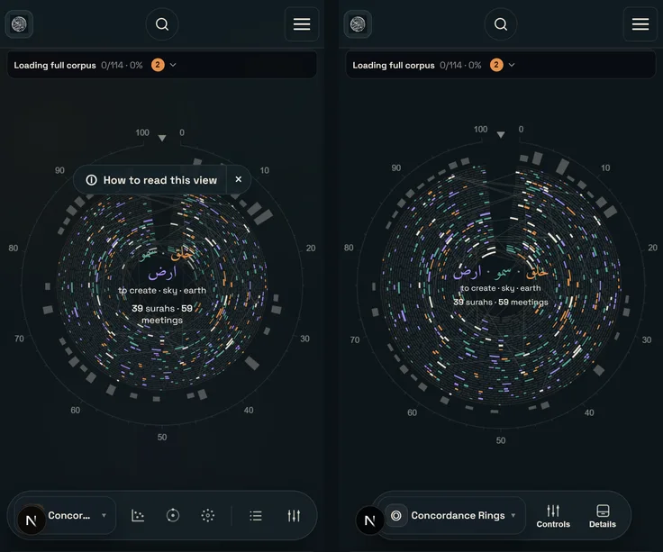
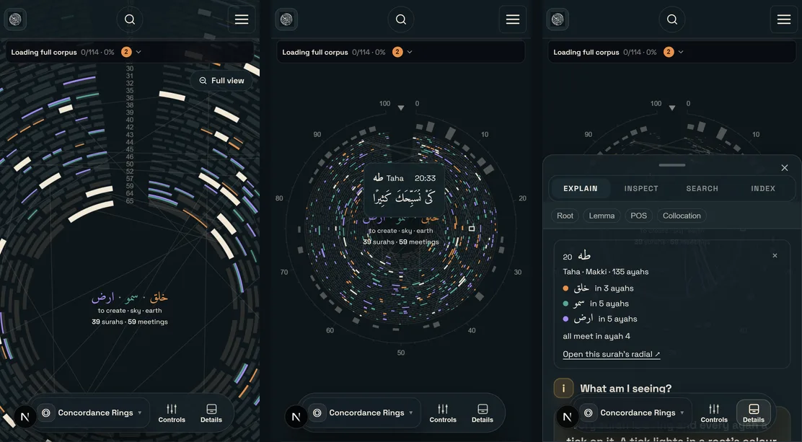
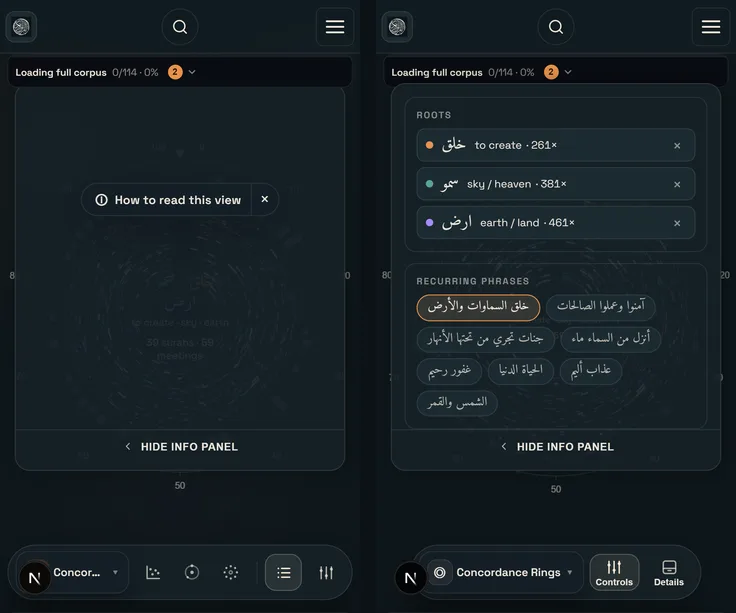
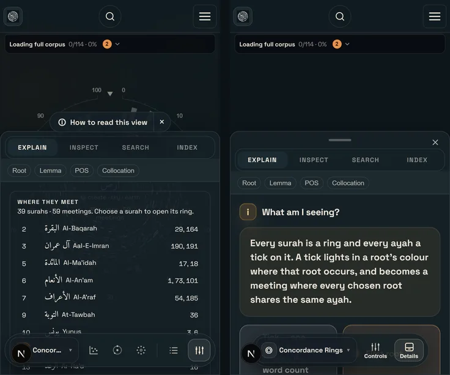
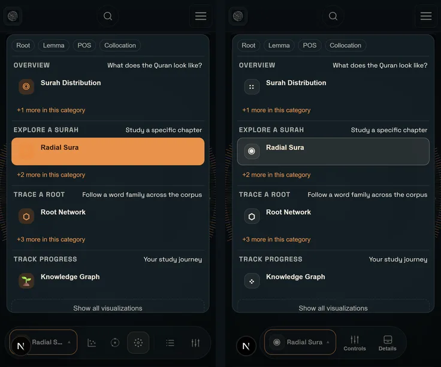
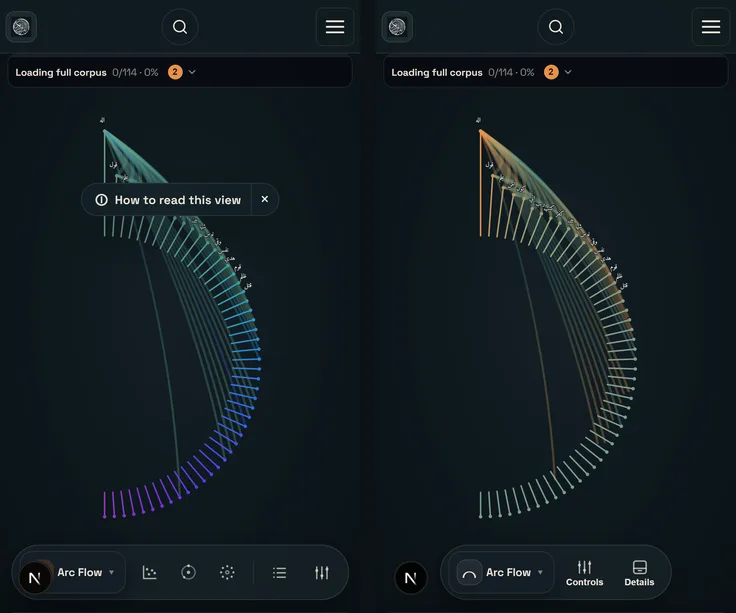
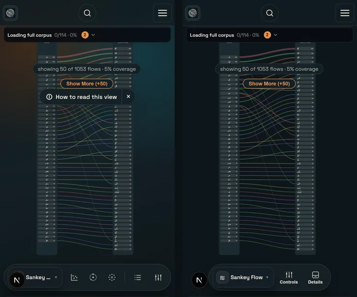

# Mobile audit — 2026-09-28

A full pass over the app on a phone, prompted by four reports: the concordance rings were slow, not always centred, and ignored two-finger zoom and pan; the full corpus seemed to load on every visit; the menus were hard to use (a hidden details panel left no obvious way back, and a sideways swipe opened a sheet from the bottom); and colours from the old design were still around.

**How it was checked.** An iPhone 13 profile in Chromium: 390 × 664 CSS px viewport, 3× density, touch, mobile user agent, rendering on the real GPU (`--use-angle=d3d11`). Timings throttle the CPU 4×, roughly a mid-range Android phone. Every visualisation mode, the menus, the pages, both themes and both languages were captured. "Before" is the live site; "after" is a local production build of this branch.

| Script | What it does |
| --- | --- |
| `scripts/audit/mobile-shots.ts` | Screenshots every surface and menu flow (tap, pinch, double tap, sheets) |
| `scripts/audit/corpus-timing.ts` | Cold visit, then reloads: time to a full corpus, Supabase requests per visit |
| `scripts/audit/rings-perf.ts` | Frames and long tasks while a finger scrubs across the rings and two fingers pinch |

## Headline numbers

Phone profile, CPU 4× slower.

| | Before | After |
| --- | --- | --- |
| Full corpus, first visit | 153 s | 16–27 s (Supabase latency varies) |
| Full corpus, reload straight after | 68 s | 2.9 s, no network |
| Full corpus, any later visit | 7.7 s | 2.9 s, no network |
| Rings, finger scrubbing (stacked) | 37 fps, 1.3 s of blocked main thread | 54 fps, 0.2 s (the one-off first text fetch) |
| Rings, pinch (stacked) | 28 fps, 1.6 s blocked, and no zoom | Zooms, no long tasks |

## Loading the corpus

**Found.**

1. **The search index was rebuilt on every page load, three times.** Each search box (the top bar and two drawer tabs) built its own catalog in a React `useMemo` as the corpus arrived, synchronously, on the main thread, whatever mode the reader was in. On a warm reload this was 24.7 s of the 28.9 s React spent (development build, 4×). `normalizeArabicForSearch` alone was 12 s: nine regex passes per call, hundreds of thousands of calls, about 20k distinct strings.
2. **The cache expired after seven days.** A time-to-live wiped IndexedDB weekly, so a returning visitor downloaded ~77k tokens again.
3. **The first visit fetched 79 pages one after another.** At phone latency that was ~47 s before any processing.
4. **The cache write held the view back** until all 77k records had been written.

**Changed.**

- One catalog per token array, shared by every search surface (`getSearchCatalog`). It is built when a query first needs it (two or more characters), or in idle time three seconds after the corpus arrives. Streaming batches never trigger it.
- `normalizeArabicForSearch` and `searchKeyVariants` are memoised; they are pure functions of the string.
- The cache is invalidated by version only (`CORPUS_CACHE_POLICY_VERSION`, `MORPHOLOGY_CACHE_VERSION`), never by age. A device downloads the corpus once, until the data changes or site data is cleared.
- Supabase pages are fetched six at a time and consumed in order, so the surah-by-surah streaming is unchanged.
- The cache write is issued at once but not awaited. Deferring it, even by ~1.5 s, or splitting it into chunks was measured to lose the cache when the reader reloaded straight after a first visit: a reload lets an issued transaction finish but drops one not yet started. The metadata that vouches for the cache is still written only after the tokens.

**Not changed.** Safari may clear script-written storage for a site not visited in seven days of browsing; an installed app (Install app) is exempt. `navigator.storage.persist()` would help in Chrome but shows a permission prompt in Firefox, so it isn't called. A first visit still needs 79 requests. A prebuilt corpus file served from the CDN would make it one, but that belongs with the `corpus_tokens` realignment.

## Concordance rings on a phone

**Found.**

1. **Every touch move redrew all three canvases.** That included the back layer, whose overlaid view is several hundred strokes.
2. **Tapping a tick did nothing.** Without hover, there was no way to read an ayah.
3. **No zoom or pan.** Pinch, drag and double tap were all ignored.
4. **The Controls sheet was empty.** On a phone the shell mounts `#viz-sidebar-portal` only while that sheet is open. The rings looked the slot up during render, before the sheet existed, and never again, so the root pickers, presets and views were unreachable.
5. **"Not always centred":** opening the Controls sheet moved the rings' centre to x ≈ 78 on a 390 px screen. The shared fit (`getVisibleArea`) treated the full-width sheet as a side column and squeezed the graph beside it. The sheet unmounts without a transition, so the rings could stay squeezed after it closed. This affected every mode's fit.
6. **The intro chip covered the 12 o'clock marker**, and on a phone it covered part of every mode.
7. **Small rings.** The scale and histogram margins took a third of the radius at phone size.

**Changed.**

- Layers redraw only when something they show changes: hover and taps redraw the front layer only.
- **Tap** reads out the ayah under the finger; **tapping the same ring again** opens its surah card; **tapping empty canvas** dismisses the read-out, then the selection.
- **Pinch** zooms and pans. While fingers move, the three canvases move as one CSS transform (a GPU composite, no redraws); on release the zoom is folded in and redrawn crisply, in the same task, so nothing flashes.
- **Other zoom inputs:** a drag pans once zoomed (at the fit it scrubs, reading out each ayah); a double tap zooms in or returns; the wheel and trackpad pinch zoom about the cursor; `+`/`−`/`0` zoom from the keyboard; **Full view** appears when zoomed.
- Zooming in thickens the rings until each tick shows every root's slot, not just the first.
- `usePortalTarget` re-resolves portal slots after every DOM change.
- `getVisibleArea` ignores a panel spanning more than 60% of the canvas: an overlay, not a column.
- The intro chip counts as top chrome in every mode's fit, and is hidden below 640 px. Its content is the Explain tab, behind the labelled Details button.
- A compact frame below 520 px gives the rings about 16% more radius, and the centre label shrinks to fit the inner hole.
- The rings re-measure on `visualViewport` resize (the iOS URL bar).

## Menus

**Found.**

1. **A sideways swipe opened a sheet from the bottom.** Edge swipes open the side panels on a desktop layout, but on a phone both panels are bottom sheets. A swipe from the screen edge is also the browser's own back gesture on iOS.
2. **"Hide info panel" broke the Legend button.** On a phone it set the desktop dock's collapsed state (persisted in localStorage). From then on the bottom bar's Legend button opened a sheet slid off-screen. Arriving from the home search ("calm entry") did the same on a first visit.
3. **Nothing labelled the way back to a hidden panel.** Both sheets were anonymous icons (a list and a set of sliders), and the details sheet had no handle or close control of its own. Its last rows sat under the bottom bar.
4. **Two breakpoints.** Panel state switched to phone behaviour at 900 px, the layout at 980 px, so 901–980 px mixed the two (already in the UX-debt ledger).
5. **Sticky hover:** a tapped button kept its hover tint and looked selected.

**Changed.**

- No edge swipes on a phone.
- On a phone, hiding the panel closes the sheet; the dock state applies on desktop only.
- The bottom bar names its sheets **Controls** and **Details**. The three quick-view shortcuts, which duplicate the mode switcher, give way below 440 px.
- The details sheet has a grip (tap it, or pull it down) and a close button, and its content scrolls clear of the bar.
- One breakpoint, 980 px, in JS and CSS.
- Hover styles apply only where hover exists (`@media (hover: hover)`).

## Colours from the old design

The palette is the V2 one: slate-teal canvas, warm ink, amber `#e8924a`, teal `#56a697`, violet `#8e84cc`, the part-of-speech spectrum, and the reserved selection cream `#fbead2`. Light mode uses the same families, deepened for parchment.

| Where | Was | Now |
| --- | --- | --- |
| Explore background (`.neural-bg`) | Amber, teal and violet corner glows and a pulsing layer (dark); teal and amber glows (light) | Flat; a faint ink dot grid in light |
| Sankey | Orange-500 and cyan-400 corner glows | Flat canvas |
| Collocation | A 16% lighter centre that read as a teal glow; neon fallback palette; Tailwind-yellow badge | Barely lifted centre; spectrum palette; amber badge |
| Arc Flow | Magenta → violet → blue → cyan ramp blended with a rainbow | Violet → teal → amber by frequency |
| "Freq" colour mode | Blue → cyan → green → amber → rose | Slate → teal → yellow → amber → coral |
| Knowledge graph | Cyan and green nodes, violet-500 glow | Violet (learning) and teal (learned) |
| Radial, highlighted root | `#FFD166`, which read as the particle yellow | The selection cream |
| Mode switcher | Orange-500 tiles (brown on dark), solid accent fill for the selected view, two colour emoji, one glyph shared by two modes | Neutral tiles, the selection tint, one monochrome glyph per mode |
| Colour-mode switch dots | The old app's blue, green and pink | Amber, teal, pink from the spectrum |
| Light theme accents | Amber-500 and blue-700 | Amber-700 and violet-700 |
| Viz theme fallbacks | Red, blue, orange-500, gray-700 | Observatory tokens |
| Quiz completion cards | Navy surfaces with corner glows, slate text, green-500 progress dots | Panel tokens, ink, the success token |
| Search progress bar | Gradient to orange-500 | Accent |
| Footer, dark | Half-transparent navy; page text showed through the credit line | Near-opaque theme surface |
| Search, Study and Quiz pages | Their own "atmospheres": Search cool grey-blue (navy in dark), Study and Quiz sepia, and dark even in the light theme, on old navy panels | The page canvas and panel tokens of every other page |
| Dead CSS | Orange-500 `.sidebar-toggle-btn` / `.floating-sidebar` | Removed |

## Other

- **Search page hydration error.** Counts were formatted with a bare `toLocaleString()`, which on this server produced Arabic-Indic digits and in the browser Latin ones. They now use the page's locale.
- **Jargon on Search.** "Shell ready" and "shell-ready dataset" are now plain language, in both languages.
- **Screenshot harness.** `scripts/ux-shots.ts` seeded a stale onboarding version, so the first-run modal could cover its shots.

## Still open

- **Sankey** still starts at the top, under the status pill, with its own coverage pill there.
- **Dependency tree** clips its vertical "AYAH" label at 390 px and leaves space above the tree.
- **Radial Surah** is slightly wider than a 390 px screen, so ticks are clipped at the sides.
- **Surah Distribution, Collocation and Knowledge graph** stay sparse until the full corpus arrives, 16–27 s on a first visit at 4× CPU. Later visits are 3 s.
- **Other bare number formatting:** 21 `toLocaleString()` calls remain in client-only components. They can't mismatch today but share the risk.
- **Visual-regression snapshots** need regenerating: the bar labels and colours changed on purpose.
- **The end-to-end suite is stale.** Most of `tests/e2e/app-smoke.spec.ts` and `theme-sync.spec.ts` look for things that no longer exist: `app-mode-nav`, which was deleted, and the explore dashboard at `/en`, which is now the search home. Those tests fail identically on `main` without these changes, which was checked. CI doesn't run them.
